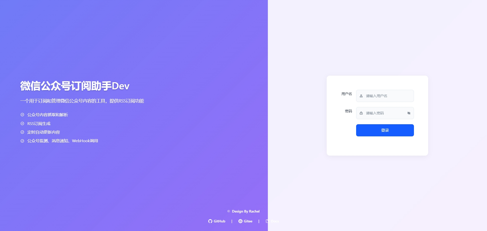
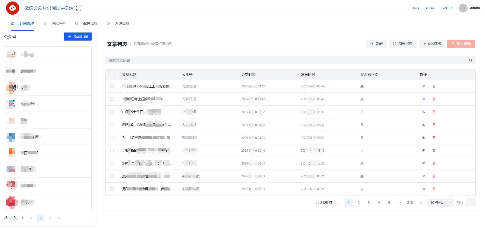
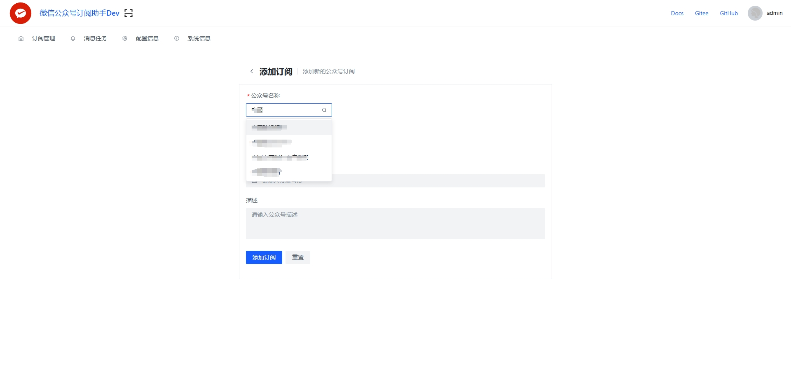
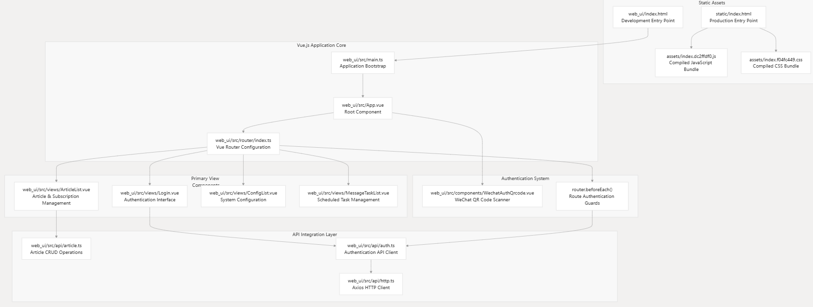

<div align=center>

<h1>WeRSS — 微信公众号订阅助手 (bulexu 维护分支)</h1>

[]()
[]()
[]()
[](https://github.com/rachelos/we-mp-rss)

[中文](README.zh-CN.md) | [English](ReadMe.md)

自托管的微信公众号内容订阅与 RSS 生成工具。**v2 起数据层切换至
[redfox.hk](https://redfox.hk) 无状态 REST 接口** —— 无需扫码授权、可
无人值守运行;**新增飞书多维表归档** —— 抓取的文章可按公众号维度推送至
指定 Bitable,实现自动入库与多人协作。
</div>

---

## 关于本项目

本仓库是 **bulexu 维护的 fork**,上游为 [rachelos/we-mp-rss](https://github.com/rachelos/we-mp-rss)
(原作者 Rachel / RachelOS)。本分支在原项目基础上做了重构与功能增强,
聚焦两个核心场景: **无人值守采集(redfox 数据层)** 与 **多维表归档
(飞书 Bitable)**。

### 上游项目 & 致谢

> 本项目基于 **<https://github.com/rachelos/we-mp-rss>** 开发,
> 感谢 RachelOS 与以下贡献者(顺序不分先后):
>
> **cyChaos、子健MeLift、晨阳、童总、胜宇、军亮、余光、一路向北、水煮
> 土豆丝、人可、须臾、澄明、五梭、Jarvis、三三、哈基米、苹果**

上游鸣谢与原 README 见
[rachelos/we-mp-rss](https://github.com/rachelos/we-mp-rss) 。
本分支所有新增能力与问题修复的版权归 bulexu 与贡献者所有,基础能力版权
归属上游作者。

---

## 本项目核心能力

### 🆕 与上游的差异

| 模块 | 上游 (rachelos) | 本分支 (bulexu) |
| --- | --- | --- |
| 数据源 | 微信扫码会话(`mp.weixin.qq.com/cgi-bin/searchbiz` + cookie) | **[redfox.hk](https://redfox.hk) 无状态 REST**(v2 起) |
| 归档 | 仅 Webhook 推送 | **Webhook + 飞书多维表 (Bitable) 自动归档** |

### ✅ 全部能力一览

#### 内容生产与分发

- **文章列表**:通过 [redfox.hk](https://redfox.hk) REST 无状态获取(搜索公众号 /
  精确查询 / 作品列表)
- **正文抓取**:**系统内自动降级** Playwright → 可选 Redfox(由
  `GATHER.CONTENT_REDFOX_FALLBACK` 开关决定);**外挂人工兜底** 八爪鱼 RPA
  (独立于系统降级,需在八爪鱼客户端单独配置)(详见下文「文章抓取策略」一节)
- RSS 订阅源生成(RSS 2.0,支持 CDATA / 全文 / 封面 / 自定义分页大小)
- 定时自动更新(间隔可配,默认 10s)
- 自定义 RSS 标题、描述、封面、分页大小
- 自定义通知渠道(钉钉 / 微信群机器人 / 飞书 / 自定义 Webhook)
- HTML 内容过滤规则(全局 + 公众号专属,优先级 0-100)
- 支持 **Markdown / DOCX / PDF / JSON** 导出

#### 飞书多维表归档(本分支新增)

- 可视化配置飞书多维表推送目标(`/lark/bitables` 后台页面)
- 每条 Bitable 可关联多个公众号(`mp_ids` 白名单),按需触达
- 字段映射白名单(`title` / `url` / `content` / `publish_time` / `mp_name` 等)
- 幂等去重:`article_lark_pushes` 复合主键,二次推送自动跳过
- 全异步执行,不拖慢抓取主流程
- 失败可重试:每条 Bitable 行的 `last_error` / `last_error_at` 记录错误

#### Web 管理后台

- 13 套主题(深色 / 护眼 / 紫 / 蓝 / 绿 / 橙 / 玫瑰 / 青 / 粉 / 靛 /
  紫罗兰 / 咖啡 / 海军蓝)
- 响应式分页(PC 翻页、移动端加载更多)
- 系统信息页(redfox 调用日志、redfox 状态、数据库信息、缓存状态)
- 内容过滤规则可视化编辑
- 多维表配置界面
- 错误捕获与降级提示

#### 安全与认证

- JWT 登录会话(默认 4320 分钟可配)
- `SAFE_HIDE_CONFIG` 自动遮蔽敏感配置展示

#### 扩展与运维

- **环境异常统计** — 自动追踪各订阅的抓取失败(redfox 限流、IP 风控、超时)
- **Headers / Cookies 认证** — Webhook 调用支持自定义请求头
- **配置缓存** — Redis / Memcached / 内存三级,降低重复读开销
- **数据库支持** — SQLite(默认)/ MySQL / PostgreSQL
- **缓存支持** — Redis(redfox 日志 / 多 worker 会话需要)

---

## 快速开始(Docker)

镜像发布在阿里云个人版仓库:

```bash
docker run -d --name we-mp-rss \
  -p 8001:8001 \
  -v ./data:/app/data \
  --env-file ./.env \
  crpi-qp8hiqijfnilf93t.cn-hangzhou.personal.cr.aliyuncs.com/bulexu/we-mp-rss:latest  
```

浏览器访问 `http://<你的 IP>:8001/`。默认账号 `admin` / `admin@123`,**首
次登录后请立即修改密码**(右上角用户菜单 → 修改密码)。

镜像**不**携带 `REDFOX_API_KEY`,通过 `.env` 注入:

```bash
# .env(一行一个,不要加引号)
REDFOX_API_KEY=ak_xxxxxxxxxxxxxxxxxxxxxxxxxxxxxxxx
LARK_APP_ID=cli_xxxxxxxxxxxx                # 可选,启用飞书多维表时填
LARK_APP_SECRET=xxxxxxxxxxxxxxxxxxxx        # 可选,启用飞书多维表时填
LARK_ENABLED=True                            # 可选,默认 False
```

### 升级

```bash
docker stop we-mp-rss && docker rm we-mp-rss
docker pull crpi-qp8hiqijfnilf93t.cn-hangzhou.personal.cr.aliyuncs.com/bulexu/we-mp-rss:latest  
# 重新执行上面那条 docker run(data/ 挂在宿主机,数据不会丢)
```

---

## 文章抓取策略

本项目对「列表 / 正文」两类数据采用分层策略,主链路无人值守,长尾兜底走人工。

### 文章列表:redfox REST

公众号搜索、账号信息、作品列表(标题 / 发布时间 / 摘要 / 封面 / URL)统一
通过 [redfox.hk](https://redfox.hk) 无状态 REST 获取,无需登录态、无 cookie,
**`GATHER.MODEL` 不再影响列表阶段**。

| 用途 | 端点 |
| --- | --- |
| 按关键词搜索公众号 | `/story/api/gzh/data/searchUser` |
| 按 ID 精确查询公众号 | `/story/api/gzh/data/accountInfo` |
| 拉取公众号作品列表 | `/story/api/gzh/data/queryWorkList` |

完整模块映射见 [docs/redfox/INTEGRATION.md](docs/redfox/INTEGRATION.md)。

### 正文抓取:Playwright + (可选 Redfox) + 八爪鱼 RPA(外挂兜底)

正文抓取难度远高于列表(微信风控 / IP 限频 / 验证码 / 内容渲染等)。本项目
分两类:**系统内自动降级**(Playwright + 可选 Redfox)+ **外挂人工兜底**
(八爪鱼 RPA,需要在八爪鱼客户端单独配置)。两者完全解耦,RPA **不**参与
自动降级判断。

#### 系统内自动降级(顺序由 `GATHER.CONTENT_REDFOX_FALLBACK` 决定)

```
                       ┌──────────────────────────────────────┐
                       │  正文抓取 — 系统内自动降级              │
                       └──────────────────────────────────────┘
                                       │
                                       ▼
                       ┌──────────────────────────────────────┐
   第 1 级 ──►  Playwright 浏览器渲染        │  driver/wxarticle.py
              (默认首选, 兼容性最好)         │  + driver/playwright_driver.py
                       │                     │
                       ▼                     │
              抓取成功? ──── 否 ────►        │
                       │                     │
                       ▼                     │
              ┌────────┴──────────┐          │
              │                   │          │
   GATHER.CONTENT_   True (默认)    │ False    │
   REDFOX_FALLBACK=  ─► 启用 Tier 2 ──► 跳过 Tier 2 ──► 标记失败
              │                   │          │
              ▼                   │          │
                       ┌────────────────────────┐
   第 2 级 ──►  redfox API 文章正文│  redfox.hk REST(可选, 默认开启)
              (回退, 不耗浏览器) │  Playwright 失败次数达阈值后切换
                       │          │
                       ▼          │
                  抓取成功?       │
                       │          │
                       ▼          │
                  标记完成          │
```

**判断逻辑**:

| `GATHER.CONTENT_REDFOX_FALLBACK` | 调用顺序 | 适用场景 |
| --- | --- | --- |
| `True`(**默认**) | Playwright → redfox → 完成 / 失败 | 想尽量拿全正文,可消耗 API 配额 |
| `False` | Playwright → 直接完成 / 失败 | 不想消耗 redfox 配额,接受部分文章无正文 |

#### 外挂人工兜底:八爪鱼 RPA(独立于系统自动降级)

> 八爪鱼 RPA **不** 参与系统自动降级判断,需要在八爪鱼客户端单独配置、
> 单独运行。它通过 Access Key 调用接口,**事后**回写 `has_content=0`
> 的文章正文。

**RPA 应用链接**:
**[八爪鱼 RPA 应用](https://rpa.bazhuayu.com/shareableLink/6aa1062894a41f8dcd647ff3)**

| 级别 | 触发方式 | 能力 | 限制 |
| --- | --- | --- | --- |
| **第 1 级 · Playwright** | 系统内自动,默认首选 | 真实浏览器渲染,JS / 验证码 / 关注墙全部能处理 | 占用浏览器进程,大规模抓取时性能受限;高频触发易被风控 |
| **第 2 级 · redfox API** *(可选)* | 系统内自动,Playwright 失败 N 次后 | 无状态 HTTP 接口,资源消耗低 | 部分强风控公众号拿不到完整 HTML;`CONTENT_REDFOX_FALLBACK=False` 时跳过 |
| **外挂 · 八爪鱼 RPA** | **人工启动**,事后回写 `has_content=0` 文章 | 真人远程操作,理论上可绕过所有风控 | 需在八爪鱼客户端单独配置运行;与系统自动降级解耦 |

#### 配套 AK 接口(RPA 回写通道)

八爪鱼 RPA 通过 Access Key 调用以下两个端点,**与系统抓取主循环完全解耦**,
任何时候都可以单独启停:

```bash
# 1. 拉取待补齐正文的文章清单(has_content=0 且未删除)
GET  /api/v1/wx/articles/pending-content?limit=10&mp_id=MP_WXS_xxx
Authorization: AK-SK {ak}:{sk}

# 2. 回写抓到的正文(或标记已删除)
POST /api/v1/wx/articles/{article_id}/content
Authorization: AK-SK {ak}:{sk}
Content-Type: application/json
{
  "content": "<p>正文 HTML / Markdown...</p>",
  "content_html": "<p>...</p>",     # 可选;缺省时由 fix_html 自动生成
  "title": "...",                    # 可选,用于覆盖
  "description": "...",              # 可选
  "pic_url": "...",                  # 可选
  "publish_time": 1735689600,        # 可选
  "deleted": false                   # true 表示文章已被发布者删除
}
```

> 使用步骤: 在八爪鱼客户端打开上述链接 → 填入本服务的 `BASE_URL` 与 AK →
> 启动后该 RPA 会轮询 `/pending-content` 并把抓到的内容 POST 回 `/content`。

#### 自动重试机制(系统内,与 RPA 无关)

`GATHER.CONTENT_AUTO_CHECK=True` 启用后,后台会定期把 `has_content=0` 的
文章重新喂给第 1 级 Playwright;失败计数达阈值(默认 3 次)后,该文章
`web_fetch_fail_count` 累加,系统会**停止继续尝试 Playwright**,避免无
意义占用。

---

## 飞书多维表归档(Lark Bitable)

本分支的核心扩展能力之一。配置完成后,任意新抓取 / 更新的公众号文章都
会自动推送到指定 Bitable,实现"公众号 → 数据库"的零运维归档。

### 前置准备

1. 在 [飞书开放平台](https://open.feishu.cn/app) 创建「企业自建应用」,
   取得 **App ID** 与 **App Secret**
2. 在多维表中给该应用授予 **可编辑** 权限
3. 在 `.env` 写入 `LARK_APP_ID` / `LARK_APP_SECRET` / `LARK_ENABLED=True`

### 添加推送目标

1. 登录后台 → 左侧菜单 → **飞书多维表**
2. 点击 **新建**,填写:
   - 名称:可读标识,如「资讯归档」
   - App Token / Table ID:从飞书多维表 URL 复制
     (`https://feishu.cn/base/{APP_TOKEN}?table={TABLE_ID}`)
   - **关联公众号**:下拉多选,只勾选需要归档的公众号
   - **字段映射**:左侧下拉选择文章字段(title / url / content /
     publish_time / mp_name 等),右侧填写飞书多维表的字段名
3. 保存后该行 `enabled=True` 即可生效

### 行为说明

- **首次入库且带正文**时触发推送,纯标题或被删除文章跳过
- **幂等**:`article_lark_pushes` 表按 `(article_id, bitable_id)` 复合主
  键去重,同一篇文章对同一 Bitable 只推一次
- **失败可重试**:每条 Bitable 行的 `last_error` / `last_error_at` 字段
  记录最近一次失败原因,修复配置即可在下一次文章入库时重试

### 诊断

后台 **系统信息** 页有 redfox 状态块,失败时也会在该 Bitable 行的「最近
错误」字段展示飞书返回码(如 `99991663` token 失效)。

---

## 系统架构

前后端分离,后端将预编译的前端作为静态资源提供:

- 后端:Python 3.13 + FastAPI + Uvicorn
- 前端:Vue 3 + Vite 8 + rolldown
- 数据库:SQLite(默认)/ MySQL / PostgreSQL
- 缓存:Redis(可选,Redfox 日志 / 多 worker 会话 / 级联队列需要)

```
┌──────────────┐    ┌────────────────────────────────────┐
│  Vue 3 SPA   │    │  FastAPI (uvicorn, port 8001)      │
│  (static/)   │◄──►│  ├─ /api/v1/wx  (article/feed/...) │
└──────────────┘    │  ├─ /api/v1/wx/redfox  (stats/logs)│
                    │  ├─ /api/v1/wx/lark   (bitables)   │
                    │  └─ /story/api/gzh/data/... (redfox)│
                    └────────────┬───────────────────────┘
                                 │
                ┌────────────────┼────────────────┐
                ▼                ▼                ▼
           SQLite/MySQL     Redis (logs,    redfox.hk
                            cache, queue)
                                 │
                                 ▼
                          Feishu OpenAPI
                          (Bitable 归档)
```

---

## 安装(开发环境)

### 环境要求

- Python ≥ 3.13.1
- Node ≥ 20.18.3

### 后端

```bash
git clone <你的 fork 仓库> we-mp-rss
cd we-mp-rss
pip install -r requirements.txt
cp config.example.yaml config.yaml
cp .env.example .env       # 填入 REDFOX_API_KEY(必填)
python main.py -job True -init True
```

`-init` 标志会创建 SQLite 数据库与默认 admin 账号;`-job` 开启定时任务。
`main.py` 通过 `load_dotenv()` 自动加载 `.env`(方便本地直接运行);在
Docker 部署中应通过 compose 的 `env_file:` 注入。

后端通过 `static/` 目录为前端页面提供静态资源。

### 前端

```bash
cd web_ui
npm install --legacy-peer-deps
npm run dev          # http://localhost:3000
```

### 生产构建(同步 static/)

后端实际服务的是 `static/` 目录里的**预编译产物**。Dockerfile 头部的注释也
写明:「前端编译非常占用工作流时间 ,可以 编译后复制到static目录再提交pull
request」。标准构建顺序:

```bash
# 1. 编译前端
cd web_ui && npm run build && cd ..

# 2. 同步 dist/ → static/(这是后端实际服务的目录)
rsync -a --delete web_ui/dist/ static/

# 3. 构建 Docker 镜像
docker buildx build --platform=linux/amd64 \
  -f ./Dockerfile \
  -t crpi-qp8hiqijfnilf93t.cn-hangzhou.personal.cr.aliyuncs.com/bulexu/we-mp-rss:v2.0.0 \
  .
```

> 镜像**不**包含 `.env` —— `.dockerignore` 已排除。运行时通过 `env_file:`
> 或 `-e` 注入 `REDFOX_API_KEY` / `LARK_*`。

---

## 环境变量

所有变量由 `core/config.py` 解析,支持 `config.yaml` 中的 `${VAR:-default}`
语法或操作系统环境变量。

### 核心

| 变量 | 默认值 | 含义 |
| --- | --- | --- |
| `APP_NAME` | `we-mp-rss` | 应用名 |
| `SERVER_NAME` | `we-mp-rss` | 服务名 |
| `WEB_NAME` | `WeRSS微信公众号订阅助手` | 前端显示名 |
| `ENABLE_JOB` | `True` | 是否启用定时任务 |
| `AUTO_RELOAD` | `False` | uvicorn `--reload`(开发用) |
| `THREADS` | `2` | uvicorn worker 数 |
| `PORT` | `8001` | API 端口 |
| `DB` | `sqlite:///data/db.db` | 数据库连接串 |
| `SECRET_KEY` | `we-mp-rss` | JWT 签名密钥 —— **生产环境务必修改** |
| `USER_AGENT` | `Mozilla/...` | 出站请求的 User-Agent |
| `DEBUG` | `False` | 调试模式 |
| `LOG_LEVEL` | `INFO` | 日志级别 |
| `LOG_FILE` | 空 | 日志文件路径(空则输出到 stdout) |
| `SAFE_HIDE_CONFIG` | `db,secret,token,notice.*` | 系统信息页中隐藏的 key |

### Redfox(必填)

| 变量 | 默认值 | 含义 |
| --- | --- | --- |
| `REDFOX_API_KEY` | — | **必填**。redfox.hk API Key |
| `REDFOX_BASE_URL` | `https://redfox.hk` | redfox API 入口 |

### 飞书多维表(本分支新增)

| 变量 | 默认值 | 含义 |
| --- | --- | --- |
| `LARK_ENABLED` | `False` | 全局启用飞书推送开关 |
| `LARK_APP_ID` | — | 飞书应用 App ID(`cli_...`) |
| `LARK_APP_SECRET` | — | 飞书应用 App Secret |
| `LARK_TIMEOUT` | `15` | 请求飞书 API 超时(秒) |

### Webhook 通知

| 变量 | 默认值 | 含义 |
| --- | --- | --- |
| `DINGDING_WEBHOOK` | 空 | 钉钉通知 Webhook |
| `WECHAT_WEBHOOK` | 空 | 微信群机器人 Webhook |
| `FEISHU_WEBHOOK` | 空 | 飞书 Webhook(与多维表归档是两套,前者是即时通知) |
| `CUSTOM_WEBHOOK` | 空 | 自定义 Webhook |
| `WEBHOOK.CONTENT_FORMAT` | `html` | 通知中文章正文的格式 |

### 内容采集

| 变量 | 默认值 | 含义 |
| --- | --- | --- |
| `GATHER.CONTENT` | `True` | 是否采集正文 |
| `GATHER.MODEL` | `app` | 采集模型(`app` / `web` / `api`) |
| `GATHER.CONTENT_AUTO_CHECK` | `False` | 定期回填缺失的正文 |
| `GATHER.CONTENT_AUTO_INTERVAL` | `59` | 回填间隔(分钟) |
| `GATHER.CONTENT_MODE` | `web` | 内容修正模式 |
| `GATHER.CONTENT_REDFOX_FALLBACK` | `True` | Playwright 失败后是否走 redfox API 兜底(`False` 则跳过 Tier 2) |
| `MAX_PAGE` | `5` | 单次抓取最大页数 |
| `SPAN_INTERVAL` | `10` | 定时任务执行间隔(秒) |
| `ARTICLE.TRUE_DELETE` | `False` | 物理删除 vs 软删除 |

### RSS 订阅源

| 变量 | 默认值 | 含义 |
| --- | --- | --- |
| `RSS_BASE_URL` | 空 | RSS 公网域名 |
| `RSS_LOCAL` | `False` | 使用本地 RSS 链接而非 `RSS_BASE_URL` |
| `RSS_TITLE` | 空 | 覆盖 feed 标题 |
| `RSS_DESCRIPTION` | 空 | 覆盖 feed 描述 |
| `RSS_COVER` | 空 | 覆盖 feed 封面 |
| `RSS_FULL_CONTEXT` | `True` | 是否在 feed 中包含全文 |
| `RSS_ADD_COVER` | `True` | 是否在 feed item 中插入封面 |
| `RSS_CDATA` | `False` | 正文用 `<![CDATA[]]>` 包裹 |
| `RSS_PAGE_SIZE` | `30` | feed 单页条数 |

### 缓存 / 导出 / 会话

| 变量 | 默认值 | 含义 |
| --- | --- | --- |
| `CACHE.DIR` | `./data/cache` | 缓存目录 |
| `CACHE.ENABLED` | `True` | 是否启用缓存 |
| `EXPORT_PDF` | `False` | 是否启用 PDF 导出 |
| `EXPORT_PDF_DIR` | `./data/pdf` | PDF 输出目录 |
| `EXPORT_MARKDOWN` | `False` | 是否启用 Markdown 导出 |
| `EXPORT_MARKDOWN_DIR` | `./data/markdown` | Markdown 输出目录 |
| `TOKEN_EXPIRE_MINUTES` | `4320` | 登录会话有效期(分钟) |

---

## Access Key 认证

用于程序化访问 API,避免暴露管理员密码。详见
[docs/AK_Authentication_Guide.md](docs/AK_Authentication_Guide.md)。

### 创建 AK

1. 登录后台,左侧菜单 → **Access Key 管理**
2. 点击 **创建 Access Key**
3. 填写名称、描述、权限、过期时间
4. **妥善保存 Access Key 与 Secret**(Secret 仅展示一次)

### 使用 AK

```bash
curl -H "Authorization: AK-SK {access_key}:{secret_key}" \
     http://localhost:8001/api/feeds
```

```python
import requests
r = requests.get(
    "http://localhost:8001/api/feeds",
    headers={"Authorization": f"AK-SK {access_key}:{secret_key}"},
)
print(r.json())
```

---

## HTML 内容过滤规则

抓取正文时按规则清理广告、推荐位等无用元素,支持全局或按公众号粒度配置。

- **作用域**:全局(不指定 `mp_id`)或公众号专属
- **优先级**:0-100,数值越大越先执行
- **过滤方式**:
  - 按 HTML `id` 移除
  - 按 CSS `class` 移除
  - 按 CSS 选择器移除
  - 按属性过滤(如 `data-type="ad"`)
  - 按正则表达式移除
  - 剥离常见元素(`<script>`、`<style>`、注释等)

```bash
# 列表
GET    /api/filter-rules

# 新建
POST   /api/filter-rules
{
  "mp_id": "[]",                  # "[]" 表示全局
  "rule_name": "全局广告清理",
  "priority": 10,
  "remove_ids": ["ad-banner"],
  "remove_classes": ["ad-container"]
}

# 更新 / 删除
PUT    /api/filter-rules/{id}
DELETE /api/filter-rules/{id}
```

---

## 界面截图

- 登录界面  
  <br/>
- 主界面  
  <br/>
- 添加订阅(已切换为 redfox 搜索)  
  <br/>
- 前端架构  
  <br/>

---

## 常见问题

**默认账号密码?** `admin` / `admin@123`,首次登录后请立即修改。

**`/mps/search` 没结果?** redfox.hk 公共库只收录热门公众号。冷门账号
请在添加订阅时直接粘贴 `fakeid`(Base64 编码的 `bizInfo`)或 `wxId`。

**去哪里申请 `REDFOX_API_KEY`?** 在
[redfox.hk](https://redfox.hk?source=redfox_api_md) 注册后到
[API Keys](https://redfox.hk/settings/api-keys?source=redfox_api_md) 创建。

**拉了新镜像后后台界面没变化?** 后端服务的是 `static/` 里的预编译产物,
如果只更新镜像但没重建 `web_ui/dist/ → static/`,UI 仍是旧版。请按上文
**生产构建** 一节重新执行三步。

**搜索返回空但 Redfox 日志也是空的?** `REDFOX_API_KEY 未配置` 是在
`_headers()` 阶段抛出的(在 `_post()` 之前),不会写日志。请看 uvicorn
stdout 或后台「系统信息」页里的 redfox 状态块。

**飞书推送没生效?** 检查三处:
1. `.env` 里 `LARK_ENABLED=True` 且 `LARK_APP_ID` / `LARK_APP_SECRET`
   不为空
2. 飞书多维表后台该 Bitable 行 `enabled=True` 且「关联公众号」下拉里有
   这篇文章所属的公众号
3. uvicorn stdout 是否有 `[lark] worker start article_id=...` 后续日志
   (skip / dispatch / push ok / push failed),定位具体跳过原因

**怎么改数据库?** 设置 `DB` 环境变量或编辑 `config.yaml` 的 `db:`

```ini
# SQLite
DB=sqlite:///data/db.db
# MySQL
DB=mysql+pymysql://<user>:<password>@<host>/<db>?charset=utf8mb4
# PostgreSQL
DB=postgresql://<user>:<password>@<host>/<db>
```

---

## 关联文档

- 升级到 v2(redfox 迁移):[docs/redfox/INTEGRATION.md](docs/redfox/INTEGRATION.md)
- Access Key 鉴权:[docs/AK_Authentication_Guide.md](docs/AK_Authentication_Guide.md)
- 级联系统(分布式采集):
  [docs/CASCADE_QUICKSTART.md](docs/CASCADE_QUICKSTART.md) /
  [docs/CASCADE_GUIDE.md](docs/CASCADE_GUIDE.md)
- 配置缓存:[docs/cache-config.md](docs/cache-config.md)
- Webhook 自定义头:[docs/headers_cookies_feature.md](docs/headers_cookies_feature.md)
- Web UI 入门:[docs/webui-quickstart.md](docs/webui-quickstart.md)
- 环境异常统计:[docs/webui-env-exception-stats.md](docs/webui-env-exception-stats.md)
- 贡献指南:[CONTRIBUTING.md](CONTRIBUTING.md)
- 安全策略:[SECURITY.md](SECURITY.md)
- 故障排查:[TROUBLESHOOTING_CASCADE.md](TROUBLESHOOTING_CASCADE.md)
- 级联配置修复:[FIX_CASCADE_CONFIG.md](FIX_CASCADE_CONFIG.md)

---

## 许可

MIT — 详见 [LICENSE](LICENSE)。本分支新增模块(`/lark/*` 飞书多维表归档、
redfox 数据层适配)与原项目同许可。